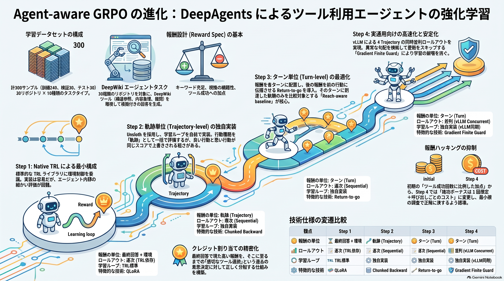
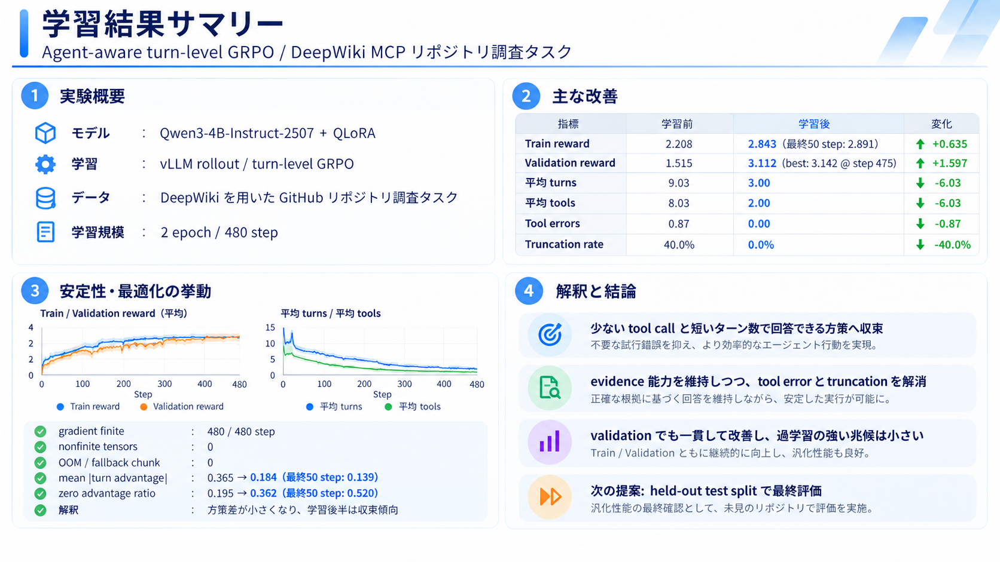

# Agent-aware GRPO with DeepAgents

このディレクトリには、**ツール利用を伴うマルチターン Agent に GRPO(Group Relative Policy Optimization)を適用する実装を、Step 1 から Step 4 まで段階的に発展させた Colab Notebook** を収録しています。

検証タスクには DeepWiki MCP を使った GitHub リポジトリ調査を採用し、単純な最終回答の品質だけでなく、**どのツールを、どの順序で、どの程度効率的に使ったか**を学習信号へ取り込むことを目標としています。

本実装でいう **Agent-aware GRPO** は、最終回答だけを1つの completion として扱うのではなく、Agent の実行軌跡(trajectory)を構成する assistant decision turn、tool call、tool observation、最終回答を追跡し、最終的には turn 単位の credit assignment まで行う GRPO を指します。



---

## Notebook 一覧

| Step | Notebook | 主題 | GRPO の粒度 | Rollout |
|---|---|---|---|---|
| Step 1 | grpo-step1.ipynb [](https://colab.research.google.com/github/haradatm/agent-aware-grpo/blob/main/notebooks/grpo-step1.ipynb) | Native TRL + `environment_factory` + QLoRA | completion / environment reward | TRL に委譲 |
| Step 2 | grpo-step2.ipynb [](https://colab.research.google.com/github/haradatm/agent-aware-grpo/blob/main/notebooks/grpo-step2.ipynb) | Unsloth + DeepAgents + 独自 GRPO | trajectory 単位 | HF/Unsloth、逐次 |
| Step 3 | grpo-step3.ipynb [](https://colab.research.google.com/github/haradatm/agent-aware-grpo/blob/main/notebooks/grpo-step3.ipynb) | Turn-Level GRPO | assistant turn 単位 | HF/Unsloth、逐次 |
| Step 4 | grpo-step4.ipynb [](https://colab.research.google.com/github/haradatm/agent-aware-grpo/blob/main/notebooks/grpo-step4.ipynb) | vLLM concurrent rollout + 安定化済み Turn-Level GRPO | assistant turn 単位 | vLLM、4 trajectory 並列 |

このほか、[Step 5](https://colab.research.google.com/github/haradatm/agent-aware-grpo/blob/main/notebooks/grpo-step5.ipynb) では **val split を使った validation** を追加し、[Step 6](https://colab.research.google.com/github/haradatm/agent-aware-grpo/blob/main/notebooks/grpo-step6.ipynb) では **データセットや報酬関数などのタスク依存部分を一箇所に集約**しています。以下では主に **Step 1 から Step 4 まで**の実装の進化を説明します。

大きな流れは次のとおりです。

```text
Step 1
Native TRL に multi-turn/tool execution を委譲
    ↓
Step 2
DeepAgents の実軌跡を自前で記録し、独自 GRPO loss を実装
    ↓
Step 3
trajectory scalar reward から turn-level reward / return / advantage へ
    ↓
Step 4
vLLM による concurrent rollout、subagent 分離、LoRA 同期、
gradient finite check まで含めて実運用向けに高速化・安定化
```

### 学習結果の例

<div align="left"></div>

---

# 検証タスク: DeepWiki を使った Repository Research Agent

## DeepWiki MCP

Agent は DeepWiki MCP に接続し、主に以下の3ツールを利用します。

- `read_wiki_structure`
- `read_wiki_contents`
- `ask_wiki_question`

Notebook では実行時に MCP サーバーから利用可能なツールを取得し、Agent に bind しています。

タスクは単なる質問応答ではなく、対象 GitHub リポジトリを調査し、

- README / ドキュメント
- 実ファイル
- ディレクトリ構造
- エントリーポイント
- 設定
- テスト
- 実装シンボル

などの根拠を DeepWiki から取得して、根拠付きの最終回答を生成するものです。

system prompt では、同じ検索の反復を避け、推測と確認済み事実を区別し、ファイルパス・シンボル名・設定名などの具体的な evidence を示すことを要求しています。

---

# データセット

各 Notebook では `deepwiki_grpo_dataset_300.jsonl` を生成・読み込みます。

## 規模

- 全体: **300 samples**
- train: **240**
- validation: **30**
- test: **30**
- 言語: **日本語**
- `max_tool_steps`: **8**
- 対象リポジトリ: **30 repositories**
- 各リポジトリ: **10 task types**

対象には、たとえば以下が含まれます。

- `Simple-Efficient/RL-Factory`
- `huggingface/trl`
- `huggingface/transformers`
- `huggingface/peft`
- `unslothai/unsloth`
- `langchain-ai/langchain`
- `langchain-ai/langgraph`
- `langchain-ai/deepagents`
- `vllm-project/vllm`
- `NVIDIA/Megatron-LM`
- `microsoft/DeepSpeed`
- `OpenRLHF/OpenRLHF`
- `volcengine/verl`
- `pytorch/pytorch`
- `jax-ml/jax`
- `fastapi/fastapi`
- `pytest-dev/pytest`

などです。

## Task type

各 repository について次の10種類を用意しています。

1. `architecture`
2. `execution_flow`
3. `dependencies`
4. `configuration`
5. `testing`
6. `training_or_core_algorithm`
7. `extension_points`
8. `debugging`
9. `api_comparison`
10. `onboarding`

したがって、

```text
30 repositories × 10 task types = 300 samples
```

という構成です。

## 1レコードの主要フィールド

```json
{
  "id": "...",
  "prompt": [...],
  "repository": "...",
  "domain": "...",
  "task_type": "...",
  "must_mention": [...],
  "evidence_requirements": [...],
  "reward_spec": {...},
  "max_tool_steps": 8,
  "language": "ja",
  "split": "train"
}
```

### `must_mention`

最終回答に含めたい重要語句です。

例:

```json
["RL-Factory", "README", "ディレクトリ", "モジュール"]
```

### `evidence_requirements`

回答だけでなく、DeepWiki で取得した observation と合わせて満たすべき根拠要件です。

例:

```json
[
  "READMEまたはドキュメント",
  "2つ以上の主要ディレクトリ",
  "中核モジュールの実ファイル"
]
```

### `reward_spec`

データセット側の基本 reward weight は次の形です。

```json
{
  "keyword_coverage_weight": 2.0,
  "evidence_coverage_weight": 2.0,
  "tool_success_weight": 0.3,
  "duplicate_tool_call_penalty": -0.5,
  "tool_error_penalty": -1.0,
  "unsupported_claim_penalty": -1.0
}
```

---

# Reward 設計

Reward は Step が進むにつれて、**最終結果中心 → trajectory 中心 → turn-level** に発展します。

## 最終回答に対する reward

Step 2 以降では、おおむね以下の構成を使います。

### 1. Keyword coverage

```text
keyword_reward
  = must_mention の充足率
  × keyword_coverage_weight
```

すべて含めれば標準設定では最大 `+2.0` です。

### 2. Evidence coverage

`evidence_requirements` を、最終回答と DeepWiki observation の両方に対して簡易ルールで評価します。

```text
evidence_reward
  = evidence requirement の充足率
  × evidence_coverage_weight
```

標準設定では最大 `+2.0` です。

判定には README の言及、複数ディレクトリ表記、ファイルパス、利用例、依存関係を示す語などを利用します。

### 3. Unsupported claim penalty

最終回答にファイルパスが書かれている場合、そのパスが DeepWiki observation に存在するかを確認します。

```text
unsupported_reward
  = unsupported path の割合
  × unsupported_claim_penalty
```

「それらしいファイルパスを hallucinate して reward を取る」ことを抑制するための項目です。

### 4. Answer quality

簡易的な品質 reward です。

- 空回答: `-1.0`
- 100文字未満: `-0.3`
- 十分な長さ: `+0.2`
- 「結論」「まとめ」「要約」を含む: さらに `+0.1`

これは主 reward ではなく、空回答や極端に短い回答を避けるための補助項です。

---

## Tool 利用に対する reward の変遷

### Step 1

DeepWiki environment 内で tool call ごとに reward を与えます。

- tool 成功: `+0.3`
- tool error: `-1.0`
- 同じ tool + args の重複: `-0.5`
- tool を一度も使わない trajectory: `-1.0`

成功 tool call 数に上限がないため、**tool を多く成功させるほど reward が増える**設計です。

### Step 2

trajectory 全体の scalar reward として、

```text
final answer reward
+ successful tool calls × tool_success_weight
+ tool error penalty
+ duplicate penalty
```

を合算します。

この段階でも成功 tool call 数に比例して加点するため、不要な tool call を増やす reward hacking の余地が残ります。

### Step 3

tool reward を **decision turn 単位**へ配置します。

Tool turn:

- 成功 tool が1件以上: success reward
- tool error: 件数分 penalty
- duplicate: 件数分 penalty
- 1 turn 内で一定数を超える tool call: 軽い extra-call penalty

Final turn:

- keyword
- evidence
- unsupported claim
- answer quality

これにより、最終回答の reward を final turn に置き、前段の decision turn には return-to-go で伝播できます。

### Step 4

Step 3 の reward shaping をさらに修正します。

特に重要なのは次の2点です。

```python
TOOL_SUCCESS_BONUS_ONCE_PER_TRAJECTORY = True
TOOL_TURN_COST = -0.05
```

つまり、

- tool success bonus は trajectory 中で最初の成功時に1回だけ
- tool を使う decision turn ごとに小さな cost

とします。

これにより、

```text
「成功 tool をたくさん呼ぶほど得」
```

ではなく、

```text
「必要な調査を行い、無駄な呼び出しを減らして、
十分な evidence を得たら final answer に進む」
```

trajectory を相対的に高く評価する方向へ変更しています。

---

# Step 1 — Native TRL + `environment_factory` + QLoRA

## 概要

Step 1 は最小構成です。

Native TRL の `GRPOTrainer` に、

- QLoRA model
- DeepWiki environment
- reward functions
- dataset

を渡し、multi-turn tool calling と GRPO training loop を Trainer に委譲します。

モデルは:

```text
Qwen/Qwen3-4B
```

を使用し、BitsAndBytes 4-bit NF4 + PEFT LoRA で学習します。

## アーキテクチャ

```text
Dataset
  │
  ▼
TRL GRPOTrainer
  │
  ├── environment_factory()
  │     └── DeepWikiEnvironment
  │           ├── read_wiki_structure
  │           ├── read_wiki_contents
  │           └── ask_wiki_question
  │
  ├── completion reward functions
  └── QLoRA model
```

## 特筆すべき実装

### `environment_factory`

DeepWiki MCP を TRL の tool environment として公開します。

`DeepWikiEnvironment` は、

- call args
- observation
- success / error
- duplicate
- step reward

を記録します。

### Completion-level reward

Trainer に以下を渡します。

- keyword coverage
- evidence coverage
- unsupported claim
- answer quality

Tool execution reward は environment 側が返します。

### QLoRA sanity check

学習開始前に、

- base model が4-bitか
- trainable parameter が LoRA の少数部分だけか

を確認します。

## このStepの意義

「既存 Trainer の拡張ポイントだけで Agent + GRPO がどこまで実装できるか」を確認する baseline です。

multi-turn/tool orchestration をほぼ Trainer に任せられるため、実装量は最も少なくなります。

## 残課題

- Agent 内部の各 assistant turn に独立した credit を割り当てにくい
- tool observation と assistant action の詳細な alignment を Trainer の外から制御しにくい
- tool success bonus が成功回数に比例する
- Trainer / Transformers / TRL の API version 依存が強い
- GRPO の内部学習処理を細かく制御したい場合に拡張しづらい

これらが Step 2 で独自 training loop を作る理由になります。

---

# Step 2 — Unsloth + DeepAgents + Trajectory-level GRPO

## 概要

Step 2 では Native `GRPOTrainer` から離れ、学習 loop を自前で実装します。

```text
Unsloth 4-bit QLoRA
      │
      ▼
DeepAgents
      │
      ├── DeepWiki tools
      ├── multi-turn state
      └── tool observations
      │
      ▼
trajectory × G
      │
      ▼
trajectory reward
      │
      ▼
group-relative advantage
      │
      ▼
clipped GRPO loss
      │
      ▼
LoRA update
```

モデルは Step 1 の adapter を引き継がず、初期 base model から新しく学習します。

## 特筆すべき実装

### `DeepAgentsPolicyModel`

LangChain / DeepAgents と Hugging Face / Unsloth model の間をつなぐ custom `BaseChatModel` wrapper です。

各 model call について、

```text
input_ids
output_ids
old_logprobs
input_text
output_text
original_input_length
used_input_length
truncated_tokens
```

を記録します。

### Tool call parsing

Qwen の `<tool_call> ... </tool_call>` を解析して `AIMessage.tool_calls` に変換し、実際の tool execution は DeepAgents に任せます。

### Old-policy logprob の保存

rollout 直後に生成 token の logprob を保存し、update 時に現在 policy の logprob と比較します。

### Hard context truncation

Agent trajectory は tool result により急速に長くなるため、

```text
MAX_SEQ_LENGTH = 6144
MAX_NEW_TOKENS = 1024
```

の範囲に収まるよう入力を切り詰めます。

system prompt / tool schema を保持するため、先頭側も一定量残します。

### Chunked backward

長い sequence の full logits を一度に保持すると OOM しやすいため、

```text
TRAIN_LOGPROB_CHUNK_SIZE = 64
```

として output token を小さい chunk に分割します。

各 chunk ごとに、

```text
forward
→ current logprob
→ clipped GRPO loss
→ backward
→ graph 解放
```

を行い、生存する計算 graph を小さく保ちます。

## GRPO の粒度

Step 2 では trajectory に1つの scalar reward を与えます。

同一 prompt から複数 trajectory を生成し、group-relative advantage を計算します。

その scalar advantage を、その trajectory 内のすべての assistant-generated token に適用します。

## Step 1 からの差分

Step 1:

```text
TRL が rollout と update を管理
```

Step 2:

```text
DeepAgents が Agent trajectory を実行
+
独自コードが old logprob / reward / GRPO loss / optimizer を管理
```

この変更で、Agent の内部状態と model turn を直接観察・制御できるようになります。

## 残課題

### 1. Credit assignment が粗い

良い最終回答を作った trajectory でも、

- 良い tool decision
- 不要な tool decision
- tool error
- 最終回答

すべてに同じ trajectory advantage が適用されます。

これは Agent 学習としては粗い credit assignment です。

### 2. Tool reward hacking

successful tool call 数に比例して reward が増えるため、検索を長く続けること自体が有利になり得ます。

### 3. Rollout が逐次

同一 prompt から複数 trajectory を作りますが、generation は基本的に逐次処理です。

### 4. Context growth

DeepWiki observation が積み重なるため hard truncation は依然必要です。

これらのうち、特に credit assignment を Step 3 で改善します。

---

# Step 3 — Turn-Level GRPO

## 概要

Step 3 の中心は **trajectory-level GRPO を turn-level GRPO へ変更すること**です。

モデルも、

```text
Qwen/Qwen3-4B-Instruct-2507
```

へ変更されています。

同一 prompt から:

```text
NUM_GENERATIONS = 4
```

trajectory を生成します。

## Level-3 credit assignment

Step 3 では Agent trajectory を、

```text
Turn 1: assistant decision
        → tool call
        → tool result

Turn 2: assistant decision
        → tool call
        → tool result

...

Final Turn:
        → final answer
```

として分解します。

### Local reward

各 turn に local reward を配置します。

Tool turn には tool execution reward、final turn には回答品質 reward を置きます。

### Return-to-go

turn `t` に対して、

```text
R_t = r_t + γ r_(t+1) + γ² r_(t+2) + ...
```

を計算します。

Notebook では、

```python
TURN_RETURN_GAMMA = 1.0
```

なので、基本的にはその turn 以降の実現 reward の総和です。

これにより、final answer で得た reward が、その回答に至る前の tool decision へ伝播します。

### Reach-aware leave-one-out advantage

マルチターン Agent では trajectory ごとに終了 turn が異なります。

そのため単純に「turn index ごとに全 trajectory を比較」すると、すでに終了した trajectory を baseline に混ぜる問題が起きます。

Step 3 では、**その turn まで実際に到達した trajectory のみ**を比較対象にして leave-one-out baseline を作ります。

概念的には、

```text
A_i,t
  = Return_i,t
  - mean(Return_j,t for other trajectories that reached turn t)
```

です。

これが Step 3 の Agent-aware GRPO の核心です。

### Turn-specific token loss

各 turn の advantage は、

**その turn で assistant が生成した token のみに適用**します。

tool observation は環境から返された入力であり、policy action ではないため training target にはしません。

## Alignment

DeepAgents が返した visible assistant messages と、rollout 中に保存した model-call record を照合し、

- final answer
- tool calls
- observations
- model-generated assistant turn

を対応づけます。

Agent framework 内部の追加 model call が存在し得るため、visible trajectory と training record の alignment を明示的に扱っています。

## Step 2 からの差分

```text
Step 2:
trajectory reward
→ trajectory scalar advantage
→ trajectory 全 token
```

から、

```text
Step 3:
turn local reward
→ return-to-go
→ reach-aware leave-one-out advantage
→ 対応する assistant turn token
```

へ変更されました。

これにより、

- 良い調査 decision
- 悪い調査 decision
- final answer

を同じ scalar で一括評価しない学習が可能になります。

## 残課題

### 1. Rollout generation が依然ボトルネック

DeepWiki I/O と model generation を trajectory ごとに逐次処理するため、GRPO group の生成に時間がかかります。

### 2. Framework 内部 model call の扱い

DeepAgents は Agent 本体以外にも内部 model call を行い得るため、visible turn と policy record の alignment が複雑です。

### 3. Tool reward shaping

この段階では成功 tool turn ごとに success reward を得られるため、検索を長く続ける incentive がまだ残ります。

### 4. Context truncation

multi-turn tool history が長くなると hard truncate が必要です。

これらを Step 4 でさらに改善します。

---

# Step 4 — vLLM Concurrent Rollouts + Safe Turn-Level GRPO

## 概要

Step 4 は Step 3 の turn-level GRPO を維持しながら、**rollout throughput と運用安定性を重点的に改善した版**です。

モデル:

```text
Qwen/Qwen3-4B-Instruct-2507
```

主な構成:

```text
Unsloth 4-bit QLoRA
       │
       ├── HF / PEFT side
       │      └── backward + optimizer
       │
       └── vLLM side
              └── concurrent rollout
                    │
                    ├── trajectory 0
                    ├── trajectory 1
                    ├── trajectory 2
                    └── trajectory 3
```

## vLLM fast inference

Unsloth の、

```python
fast_inference=True
```

を利用して vLLM engine を有効化します。

L4 / A10 の VRAM 容量に応じて `gpu_memory_utilization` を切り替える構成です。

## Concurrent trajectories

```python
MAX_CONCURRENT_TRAJECTORIES = 4
VLLM_MICROBATCH_MAX_SIZE = 4
```

同一 prompt から生成する4 trajectory を `asyncio` で同時進行させます。

DeepWiki MCP の I/O 待ち中に別 trajectory の generation を進められるため、Agent workload と相性が良い構成です。

## Rollout coordinator

各 Agent の model request を queue へ送り、短い待ち時間の間に到着した request を vLLM micro-batch にまとめます。

```text
Agent trajectory
     │
     ▼
VLLMGenerationRequest
     │
     ▼
Coordinator Queue
     │
     ▼
micro-batch
     │
     ▼
vLLM
```

## vLLM old-policy logprob

Step 2 / 3 では rollout 後に HF forward を追加で実行して old logprob を求めていました。

Step 4 では vLLM generation 時に sampled token logprob を取得し、そのまま old-policy logprob として保存します。

取得できない場合のみ HF fallback を使います。

## LoRA synchronization

HF / PEFT side で `optimizer.step()` した後、vLLM が古い LoRA を使い続けないよう、新しい `LoRARequest` を作成します。

概念的には、

```text
rollout policy_version = N
        │
        ▼
GRPO backward
        │
        ▼
optimizer.step()
        │
        ▼
policy_version = N + 1
        │
        ▼
LoRARequest を再生成
        │
        ▼
次の vLLM rollout
```

です。

## Main agent / subagent の分離

DeepAgents の `general-purpose` subagent が同じ model を内部で呼ぶ場合、その internal call を main policy trajectory に混ぜると credit assignment が壊れます。

Step 4 では、

- main agent: `record_for_training=True`
- subagent: `record_for_training=False`

の別 wrapper を用意し、**main assistant decision のみ GRPO training record に含めます**。

subagent の結果は environment/tool result として parent agent に返します。

## Tool reward hacking の抑制

Step 4 では、

```python
TOOL_SUCCESS_BONUS_ONCE_PER_TRAJECTORY = True
TOOL_TURN_COST = -0.05
```

を導入しています。

これにより、「tool call を増やすだけで reward が上がる」設計から離れます。

## Context length

```text
MAX_SEQ_LENGTH = 8192
MAX_NEW_TOKENS = 1024
```

生成入力の上限は実質、

```text
8192 - 1024 = 7168 tokens
```

です。

長い Agent history に対して hard truncation を行います。

## Gradient checkpointing

Unsloth smart gradient checkpointing を使い、長い 8K context の training memory を抑えています。

## Safe backward

最終版では、

```python
TRAIN_LOGPROB_CHUNK_SIZE = 1024
UPDATE_TURN_BATCH_SIZE = 1
OOM_FALLBACK_CHUNK_SIZE = 256
```

です。

一度、複数 turn をまとめる whole-turn batching による高速化を試したものの、variable-length sequence と logprob alignment の組み合わせで non-finite gradient が発生し得るため、最終版では使用しません。

現在は、**token alignment が確認済みの chunked GRPO path** を使います。

通常は1024 token chunk、OOM時のみ256 tokenへ fallback します。

## Gradient finite check

`optimizer.step()` 前に全 gradient を検査します。

```text
NaN / Inf なし
    ↓
gradient clipping
    ↓
optimizer.step()
```

NaN / Inf が1つでも存在すれば、

```text
optimizer.step() を実行しない
LoRA を更新しない
vLLM に壊れた LoRA を同期しない
```

ようにしています。

これは高速化の試行中に発生した non-finite gradient が policy を破壊する事故を防ぐための safety mechanism です。

## vLLM standby と CUDA allocator

Step 4 では vLLM standby を利用します。

standby と PyTorch の `expandable_segments` が共存しない環境があるため、Unsloth / Torch import 前に allocator 関連環境変数を整理します。

また Colab の CUDA 12.x 環境では、vLLM wheel の CUDA build と Torch 側 CUDA の互換性に注意が必要です。

## Step 3 からの差分

主な差分は以下です。

```text
Step 3
HF/Unsloth rollout
逐次 trajectory
framework internal call の alignment を後処理
tool success bonus が複数回入り得る
```

から、

```text
Step 4
vLLM rollout
4 trajectory concurrency
micro-batching
vLLM sampled-token old logprob
main/subagent record 分離
trajectory 1回限定 success bonus
tool-turn cost
LoRARequest 同期
gradient finite guard
Colab GPU preflight
```

へ発展しています。

## 残課題

### 1. Context truncation

8192 context に拡張しても、DeepWiki observation が長い task では 7168 input token を超えます。

hard truncation では古い履歴の一部が失われるため、将来的には、

- tool observation の圧縮
- evidence-aware memory
- structured scratchpad
- RL alignment を壊さない summarization

などが候補です。

### 2. Backward throughput

vLLM により rollout は高速化できますが、8K context の GRPO backward は依然として重い処理です。

安全性のため whole-turn batch update は使っていないので、training side の高速化余地は残っています。

### 3. Tool budget の厳密な制御

Agent framework の middleware / recursion / subagent interaction を含めると、tool budget の定義と「何を1 step と数えるか」は単純ではありません。

学習用 reward と実行制約で同じ tool budget semantics を共有する設計は今後の改善対象です。

### 4. Reward evaluator は heuristic

`evidence_satisfied()` や unsupported-path 判定は軽量な rule-based evaluator です。

より厳密にする場合は、

- structured evidence ID
- citation-aware reward
- deterministic verifier
- separate judge model

などへ置き換える余地があります。

### 5. Version coupling

Unsloth、vLLM、Transformers、Torch、CUDA の組み合わせに依存するため、Colab runtime 更新時には version / capability check が重要です。

---

# Step 1 → Step 4 で何が変わったか

| 観点 | Step 1 | Step 2 | Step 3 | Step 4 |
|---|---|---|---|---|
| Agent runtime | TRL environment | DeepAgents | DeepAgents | DeepAgents |
| Training loop | TRL | custom | custom | custom |
| Quantization | BitsAndBytes QLoRA | Unsloth QLoRA | Unsloth QLoRA | Unsloth QLoRA |
| Reward unit | completion + env | trajectory | turn | turn |
| Credit assignment | Trainer依存 | trajectory scalar | RTG + reach-aware LOO | RTG + reach-aware LOO |
| Old logprob | Trainer管理 | HF再計算 | HF再計算 | vLLM generationから取得 |
| Rollout | Trainer管理 | sequential | sequential | concurrent |
| Group size | 2 | 2 | 4 | 4 |
| Context対策 | Trainer側 | hard truncate | hard truncate | hard truncate |
| OOM対策 | Trainer側 | token chunk backward | token chunk backward | 1024 chunk + 256 fallback |
| Subagent isolation | N/A | なし | 後処理alignment | 明示的に分離 |
| Tool reward hacking対策 | 弱い | 弱い | 改善 | success 1回 + turn cost |
| Gradient finite guard | なし | なし | なし | あり |
| vLLM | なし | なし | なし | あり |

---

# GRPO の計算イメージ

Step 3 / Step 4 の学習対象を簡略化すると次のようになります。

同じ prompt から `G=4` trajectory を生成:

```text
Trajectory A
  turn 0 -> tool
  turn 1 -> tool
  turn 2 -> final

Trajectory B
  turn 0 -> tool
  turn 1 -> final

Trajectory C
  turn 0 -> tool
  turn 1 -> tool
  turn 2 -> tool
  turn 3 -> final

Trajectory D
  turn 0 -> tool
  turn 1 -> tool
  turn 2 -> final
```

各 turn に local reward を置きます。

```text
r_i,t
```

return-to-go:

```text
R_i,t = Σ γ^(k-t) r_i,k
```

同じ turn に到達した他 trajectory だけで leave-one-out baseline を作り、

```text
A_i,t = R_i,t - baseline_i,t
```

を得ます。

そして、その advantage は対応する assistant turn の生成 token にのみ適用します。

```text
assistant-generated tokens
        ↓
current logprob / old logprob
        ↓
importance ratio
        ↓
clipped GRPO objective
        ↓
turn advantage
        ↓
LoRA gradient
```

DeepWiki tool observation は policy が生成した action ではないため、loss target には含めません。

---

# 実行上の注意

## Colab

各 Notebook は Colab での実行を前提に依存関係をインストールします。

Step 4 は特に vLLM / CUDA build の影響が大きいため、install cell 実行後に runtime restart が必要になる場合があります。

## GPU

Notebook 内では BF16 対応 GPU を前提に capability check を行います。

Step 4 は L4 22GB と A10 24GB を意識した vLLM memory utilization 設定を持ちます。

## Checkpoint

各 custom training loop は一定 step ごとに LoRA adapter / tokenizer を保存し、学習終了後に final adapter を保存する構成です。

---

# この実装から得られるポイント

この4 Step の主眼は「GRPO の loss formula を実装すること」だけではありません。

Agent RL では、

1. **何を policy action とみなすか**
2. **tool observation を training target からどう除外するか**
3. **internal/subagent model call をどう扱うか**
4. **最終 reward を過去の decision turn にどう帰属させるか**
5. **可変長 trajectory 間で baseline をどう比較するか**
6. **rollout policy と training policy をどう同期するか**
7. **長い Agent context をどうメモリ内に収めるか**
8. **reward hacking をどう防ぐか**
9. **高速化しても token/logprob alignment を壊さないか**

が重要になります。

Step 1 から Step 4 は、これらを順番に露出させながら、最終的に

```text
DeepAgents
+ DeepWiki MCP
+ Unsloth QLoRA
+ vLLM concurrent rollout
+ turn-level reward
+ return-to-go
+ reach-aware leave-one-out advantage
+ token-aligned clipped GRPO
```

まで発展させた検証実装です。
